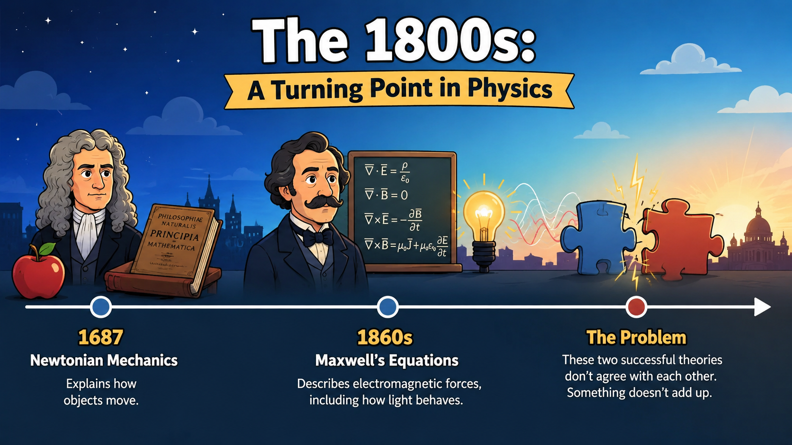
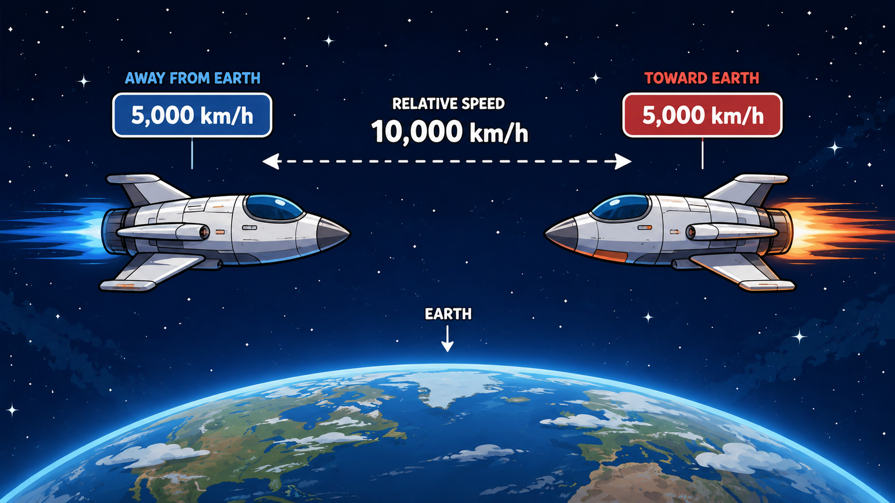
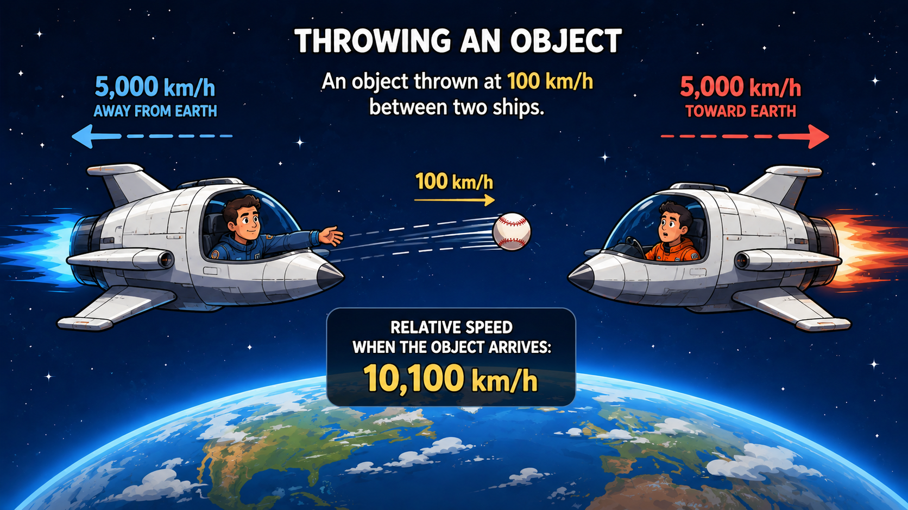
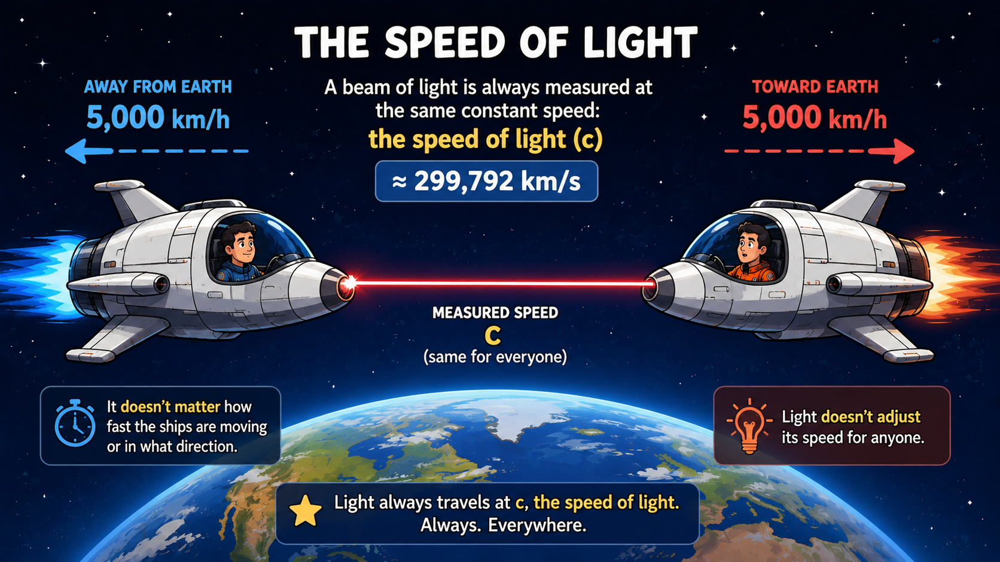

# Scene: Introduction

{animation=slow-zoom transition=fade}

To understand Special Relativity, we need to travel back to the 1800s.

At that time, science had two incredibly successful models describing the world.

The first was Newtonian mechanics, which explained how objects move.

The second was Maxwell’s set of equations, which described electromagnetic forces, including how light behaves.

The problem was that these two theories didn’t play well together.

Rather than getting too scientific, let’s explore this mismatch through a simple thought experiment.

# Scene: Two Spaceships

{animation=slow-pan-right transition=fade}

Picture two spaceships in motion.

One is flying away from Earth at 5,000 km/h, and the other is heading toward Earth at that same speed.

To someone riding on the ship moving away, the incoming ship would appear to be closing in at 10,000 km/h.

That’s perfectly reasonable.

Speed is always measured relative to something — be it Earth, the Sun, or another object.

So in this case, the relative speed between the ships is 10,000 km/h.

# Scene: Throwing a Baseball

{animation=slow-zoom transition=cut}

Now, imagine a person throws an object from one spaceship toward the other at 100 km/h.

The receiving ship would encounter it at a relative velocity of 10,100 km/h.

So far, everything fits with our everyday intuition.

# Scene: The Speed of Light

{animation=slow-zoom transition=fade}

But things take a strange turn when we replace the thrown object with a beam of light.

According to both experimental data and theoretical models, light doesn’t arrive at lightspeed plus 10,000 km/h.

Instead, it always arrives at the same constant speed: the speed of light.

It doesn’t care how fast the ships are moving or in what direction.

Light refuses to adjust its speed for anyone.
